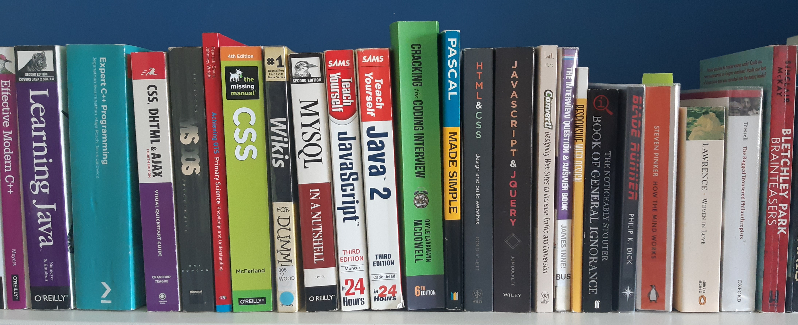

# Code 4 All 

## Anyone can code! 

# Love Programming

Programming is fun, if you start off on the right foot.

A good place to start is first understanding what programming actually is without getting bogged down by learning any particular language.

Some popular languages includes:

<ul><li>HTML, CSS</li><li>JavaScript</li><li>Python</li><li>Pascal</li><li>SQL</li></ul>

Wait. What?  Pascal? What's Pascal? You might well ask.

I've put <strong>PASCAL</strong> in the list because it was designed specifically for teaching programming.

Pascal is very easy to learn. It has simple syntax, and encourages you to write structured code from the beginning.

## Other fun stuff;

<ul><li>Pascal, COBOL and other old languages</li><li>Fixing PCs</li><li>Historic Computing</li></ul>
<ul><li>Star Trek rather than Star Wars</li><li>Marvel</li><li>Batman</li><li>not a Gamer</li></ul>

If you are stuck with any HTML, CSS, JavaScript, Python and Web Dev drop me a line and I'll see what I can do.
